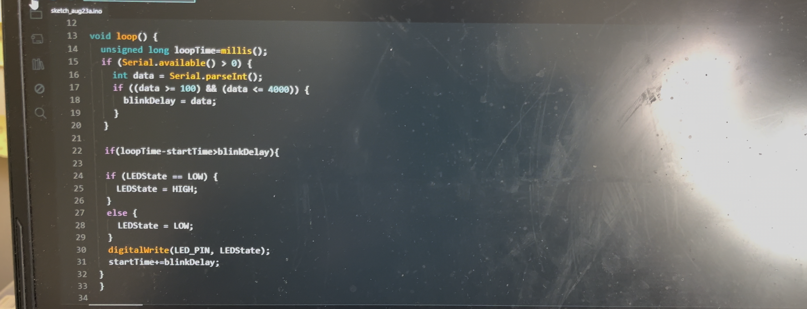

# Sending signals to program the blink rate of the LED, but refactored code to not just use delay() function

I simply removed the delay function because it limits the flow of my program. So I used millis() to calculate the time before and after the start of the program and used conditional logic to only blink the LEDs at 
the calculated rate.

## Video Demonstration

Click the thumbnail below:

